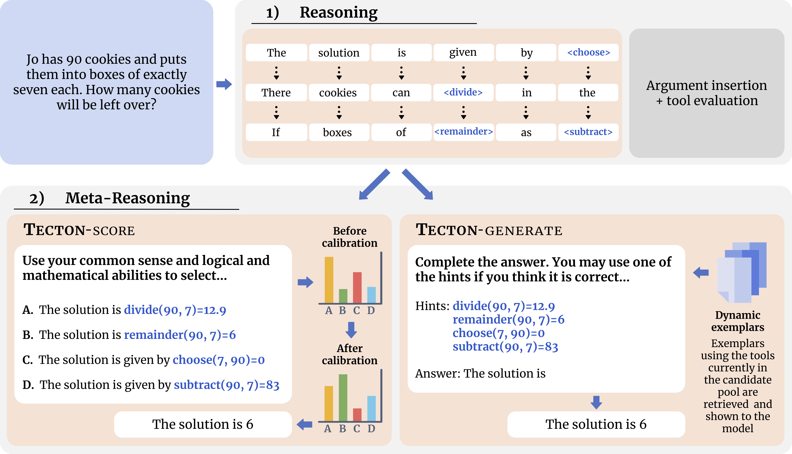

Official repository for [Meta-Reasoning Improves Tool Use in Large Language Models](https://arxiv.org/abs/2411.04535)





### Instructions

Before running the repository, the Llama3 8B Instruct checkpoint must be obtained. See instructions [here](https://github.com/meta-llama/llama3).

Installation:

````
git clone https://github.com/lisaalaz/tecton.git
cd tecton
python -m venv 'tecton_env'
. tecton_env/bin/activate
pip install -r requirements.txt
````

To fine-tune on GSM8K-XL:

````
CUDA_VISIBLE_DEVICES=0 python -m torch.distributed.run --nproc_per_node 1 --master_port 1200 train.py \
--ckpt_dir llama3/8B \
--tokenizer_path llama3/8B/tokenizer.model \
--input_file data/gsm8k-xl/train.json \
--lr 1e-3 \
--num_epochs 10 \
--dataset gsm8k-xl
````

To run inference on GSM8K-XL with TECTON-score:

````
CUDA_VISIBLE_DEVICES=0 python -m torch.distributed.run --nproc_per_node 1 --master_port 3000 inference.py \
--ckpt_dir llama3/8B-instruct \
--tokenizer_path llama3/8B-instruct/tokenizer.model \
--mode score \
--dataset gsm8k-xl \
--func_load_path checkpoints/best_checkpoint.pth \
--logits_bias 3.0
````

To run inference on GSM8K-XL with TECTON-generate:

````
CUDA_VISIBLE_DEVICES=0 python -m torch.distributed.run --nproc_per_node 1 --master_port 3000 inference.py \
--ckpt_dir llama3/8B-instruct \
--tokenizer_path llama3/8B-instruct/tokenizer.model \
--mode generate \
--dataset gsm8k-xl \
--func_load_path checkpoints/best_checkpoint.pth \
--logits_bias 3.0
````
